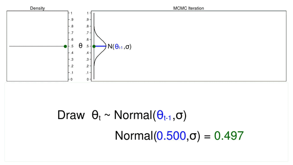

class: title-slide
count: false

# Likelihood-free Markov chain Monte Carlo using Approximate Likelihood Ratios

 

**Joeri Hermans**, .small[University of Liège] 
*Volodimir Begy*, .small[University of Vienna, CERN] 
*Gilles Louppe*, .small[University of Liège]

---
class: middle, center
# background
---
## Posterior inference
---
## Markov chain Monte Carlo

Consider the posterior density:

$$p(\theta\vert x) = \frac{p(\theta)p(x\vert\theta)}{p(x)}$$

Typically, the evidence $p(x)$ is intractable, but pointwise evaluations of the likelihood $p(x\vert\theta)$ are possible.

**Idea**: Approximate the posterior by creating a *chain* of *dependent* posterior samples through evaluating the transition $\theta_t \rightarrow \theta'$ using the *likelihood-ratio*.

$$
  \frac{p(\theta'\vert x)}{p(\theta_t\vert x)} =
  \frac{
    \displaystyle\frac{p(\theta')p(x\vert\theta')}{p(x)}
  }{
    \displaystyle\frac{p(\theta_t)p(x\vert\theta_t)}{p(x)}
  } =
  \frac{p(\theta')p(x\vert\theta')}{p(\theta_t)p(x\vert\theta_t)}
$$
$\rightarrow$ Does not depend on the intractable evidence $p(x)$!
---
### Metropolis-Hastings
> Initially proposed by Metropolis (1953), and later refined by Hastings (1970) to account for non-symmetric transition distributions.

**Idea**: introduce a transition distribution $q(\theta)$ to draw *proposals* $\theta'$.
    
.center.width-70[]

.footnote[
- Credit: animation from stata software.
- The transition distribution is also called the proposal distribution in literature.
]
---
### Issues with parameteric transition distributions
 
 
- **Sharp transition distribution**
 - High autocorrelation
 - High acceptance rate
- **Wide transition distribution**
 - Lower acceptance rate
 - Does not necessaraly mean a low autocorrelation, e.g., high rejection rate.
- **Multimodel posterior**
 - Can the transition distribution yield proposals which jump across different modes?

 
 
**Ideally**: the transition distribution should be identical in shape to the posterior.
---
### Hamiltonian Monte Carlo
---
class: middle, center
# problem setting

What if the likelihood $p(x\vert\theta)$ is also intractable?
---
class: middle, center
# method
---
class: middle, center
# experiments
---
## Linear probabilistic model
---
## Particle tracker alignment
---
## Gravitational strong lensing
---
class: middle, center
# future work
---
# References
.smaller[
1. Metropolis et al., Equation of state calculations by fast computing machines. (1953)
2. Hastings, Monte Carlo sampling methods using Markov chains and their applications. (1970)
]
---

class: end-slide, center
count: false

fin
