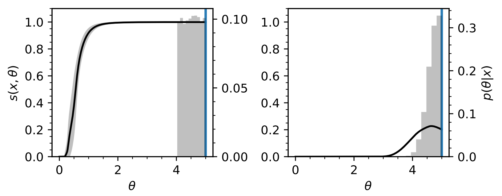

class: title-slide
count: false

# Likelihood-free Markov chain Monte Carlo using Approximate Likelihood Ratios

 

**Joeri Hermans**, .small[University of Liège] 
*Volodimir Begy*, .small[University of Vienna, CERN] 
*Gilles Louppe*, .small[University of Liège]

---
class: middle, center
# background
---
## Posterior inference

Given an model $M$ generating observations $x \in \mathbb{R}^d$ under parameters $\theta$,
then the posterior $p(\theta\vert x)$ for a set of observations $O$ is

$$\displaystyle p(\theta\vert x) = \prod_{x \in O} \frac{p(\theta)p(x\vert\theta)}{p(x)}.$$

This can be evaluated easily when one has access the *likelihood* $p(x\vert\theta)$ and the *evidence* $p(x)$.

---
## Markov chain Monte Carlo

Consider the posterior density:

$$p(\theta\vert x) = \frac{p(\theta)p(x\vert\theta)}{p(x)}$$

Typically, the evidence $p(x)$ is intractable, but pointwise evaluations of the likelihood $p(x\vert\theta)$ are possible.

**Idea**: Approximate the posterior by creating a *chain* of *dependent* posterior samples through evaluating the transition $\theta_t \rightarrow \theta'$ using the *likelihood-ratio*.

$$
  \frac{p(\theta'\vert x)}{p(\theta_t\vert x)} =
  \frac{
    \displaystyle\frac{p(\theta')p(x\vert\theta')}{p(x)}
  }{
    \displaystyle\frac{p(\theta_t)p(x\vert\theta_t)}{p(x)}
  } =
  \frac{p(\theta')p(x\vert\theta')}{p(\theta_t)p(x\vert\theta_t)}
$$
$\rightarrow$ Does not depend on the intractable evidence $p(x)$!
---
### Metropolis-Hastings
> Initially proposed by Metropolis (1953), and later refined by Hastings (1970) to account for non-symmetric transition distributions.

**Idea**: introduce a transition distribution $q(\theta)$ to draw *proposals* $\theta'$.
    
.center.width-70[]

.footnote[
- Credit: animation from stata software.
- The transition distribution is also called the proposal distribution in literature.
]
---
### Issues with parameteric transition distributions
 
 
- **Sharp transition distribution**
 - High autocorrelation
 - High acceptance rate
- **Wide transition distribution**
 - Lower acceptance rate
 - Does not necessaraly mean a low autocorrelation, e.g., high rejection rate.
- **Multimodal posterior**
 - Can the transition distribution yield proposals which jump across different modes?

 
 
**Ideally**: the transition distribution should be identical in shape to the posterior.
---
### Hamiltonian Monte Carlo
> Designing appropriate transitions are annoying, can we get rid of them?

**Idea**: model the likelihood as a potential energy surface
$$U(\theta) = -\log p(x\vert\theta),$$
and assign some kinetic energy to the current state $\theta_t$
$$K(\theta) = \frac{1}{2}m^2~~~~\text{with}~m\sim q(m).$$
 
$\rightarrow$ Simulate Hamiltonian dynamics to extract a proposal $\theta'$!

- Significantly smaller autocorrelation
- Ability to capture different modes
- Comes at a computational cost, but has a higher acceptance rate.

---
<iframe style="position:absolute;top:0;left:0;" width="100%" height="100%" src="https://chi-feng.github.io/mcmc-demo/app.html#HamiltonianMC,banana" frameborder="0" allowfullscreen></iframe>
---
class: middle, center
# problem setting

What if the likelihood $p(x\vert\theta)$ is also intractable?
 
 
$$p(\theta\vert x) = \frac{p(\theta)\cancel{p(x\vert\theta)}}{\cancel{p(x)}}$$
---
class: middle, center
# method

**tldr**: we build a model $s(x, \theta)$ which estimates the likelihood ratio, and embed the likelihood ratio model into common MCMC samplers.
---
## Approximate likelihood ratios
When comparing two hypothesis $\theta_0$ and $\theta_1$, one can train a classifier $s$ to distinguish samples
$x \sim p(x\vert\theta_0)$ and $x \sim p(x\vert\theta_1)$. This yields the optimal probablistic classifier

$$s(x) = \frac{p(x\vert\theta_0)}{p(x\vert\theta_0) + p(x\vert\theta_1)}.$$

Then the likelihood ratio $r(x)$ of $p(x\vert\theta_0)$ against $p(x\vert\theta_1)$ is,

$$r(x) = \frac{p(x\vert\theta_0)}{p(x\vert\theta_1)} = \frac{s(x)}{1 - s(x)}.$$

$\rightarrow$ *Supervised classification is equivalent to likelihood ratio estimation.*

**However**, training $s$ for every $\theta$ is rather cumbsersome...
---
### Parameterized classifiers
Include $\theta$ as input in $s(x, \theta)$ and use a *reference hypothesis* to classify against.

$$s(x, \theta) = \frac{p(x\vert\theta)}{p(x\vert\theta) + p(x\vert\theta_\text{ref})}$$

Then the $\log r(x, \theta_0, \theta_1)$ can be written as

$$\log r(x, \theta\_0, \theta\_1) = \log\frac{p(x\vert\theta\_0)}{p(x\vert\theta\_1)}= \log\frac{p(x\vert\theta\_0)}{p(x\vert\theta\_\text{ref})} - \log\frac{p(x\vert\theta\_1)}{p(x\vert\theta\_\text{ref})}.$$

Using the optimal classifier $s(x, \theta)$,

$$\log r(x, \theta\_0, \theta\_1) = \log\frac{s(x, \theta\_0)}{1 - s(x, \theta\_0)} - \log\frac{s(x, \theta\_1)}{1 - s(x, \theta\_1)}.$$

**Problem solved?**

$\rightarrow$ What if there is no support between $p(x\vert\theta)$ and $p(x\vert\theta\_\text{ref})$?

$\rightarrow$ Adds an additional hyperparameter to the optimization algorithm.
---
### Proposed solution

**Idea**: ensure support for all $\theta \in \Theta$ during training $\rightarrow$ proper constraints.

Train the classifier to distinguish samples from $p(x\vert\theta)$ and the evidence $p(x)$.

Under this formalism, the decision function of $s(x, \theta)$ becomes

$$s(x, \theta) = \frac{p(x\vert\theta)}{p(x\vert\theta) + p(x)}.$$

 
.center.width-90[]
---
class: middle, center
# application to MCMC samplers
---
## Likelihood-free Metropolis-Hastings
---
## Likelihood-free Hamiltonian Monte Carlo
---
class: middle, center
# experiments
---
## Linear probabilistic model
---
## Particle tracker alignment
---
## Gravitational strong lensing
---
class: middle, center
# future work
---
class: end-slide, center
count: false

fin
